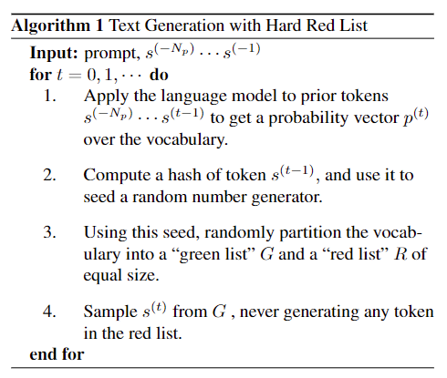
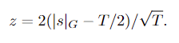
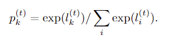
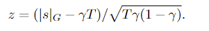
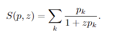
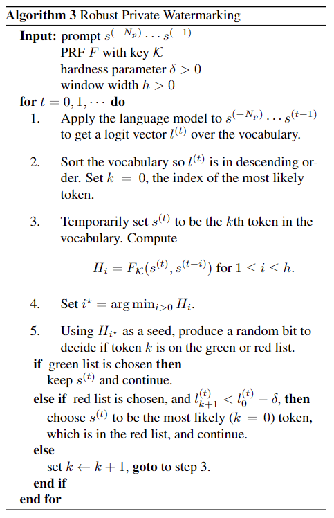

# A Watermark for Large Language Models

# Motivation

increasing risk that they may be used for malicious purpose 恶意目的  (Bergman et al., 2022; Mirsky
et al., 2023)

These include social engineering and election manipulation campaigns that exploit automated bots on social media platforms, creation of fake news and web content, and use of AI systems for cheating on academic writing and coding assignments. 本文原创

Furthermore, the proliferation of synthetic data on the web complicates future dataset creation efforts, as synthetic data is often inferior to human content and must be detected and excluded before model training (Radford et al., 2022). 生成数据不如人, 需要提前排除

# 水印算法优点
1. 算法可知, 不需要任何模型和API
2. 不需要生成模型重新训练
3. 连续内容下的水印, 哪怕放到更大的文档中, 依然存在
4. 水印无法被去掉, 即使修改后依然可见
5. 可以使用统计办法计算水印值

# 原理基础
LLM 也是有 vocabulary, 通常也就50K, 所有的 token 都从这个 vocabulary 中选

预测下一个token是基于前序 token, 是 prefix -> NN -> logits(未归一化的概率分布, 就vector) -> softmax 概率归一 -> next token (sample办法要么 greedy 要么 beam search)

难点: low-entropy sequences 低信息熵序列, 俩问题: 人写的和机器写的差不多; 加上水印会导致很 perplexity 困惑, 降低质量

作者定义了句子的信息熵, 并分析了水印影响

# 概念论证
算法1: 硬水印, 得到当前的概率分布 vector, 然后以 上一个 token 为基础, 计算一个 hash 当作随机数种子, 随机把 vocabulary 分成 俩部分, 绿的G 和红的 R, 从 G 选, 不从 R 选

检测: 生成时候需要 access LLM, 但是 detect 时候只需要知道 hash function 和 随机数生成器 即可, 这样可以重新生成 G 和 R, 去做验证

数学验证: 假设有 T 个 tokens, 每次都有 $(1/2) ^ T$ 的概率不违反 G , 想要连续只使用 G, 则概率极低为 $T * (1/2) ^ T$

使用统计的办法: z-value

$|s|_G$ 是 G 类的 tokens, 理应为 T/2, 方差 T/4. 该计算方法的物理理解: 绿色token和人类期望值的差值 乘以 2, 然后除以 T 的开方

数学论证, 很难去掉水印

缺点: 硬编码的 red, 会强制不出现, 降低水印水平

算法2: 软水印, 拿到最后的 logits vector, 计算一个 hash 并生成随机数, 设定一个 G 的比例值 γ, 大小为: $γ|V|$; R的大小就是 $(1-γ)|V|$, 然后对所有 G 中的 token 增加权重 δ, 获得新的 logits 后 使用 softmax 归一, 最后 sample

这个等式就是 softmax 怎么把 logits 变成了 概率分布

软水印, 在 R 输出特别强烈时候, P = 1, 还会输出 R, 而不是 G, 维持了文本质量

软水印计算 z-value: 

实际的 G token 和期望的 G token 的差 / (总token数 * G 权重 * R 权重) 的开方

一个纯空想, 不知道理论是啥

token spike 信息熵的计算: 

z 是 entorpy 的一个固定 scalar 标量

一些问题：在低信息熵的文本中，会出现 data memorization 数据记忆，直接就是人写的；会有重复的文本出现，解决办法就是只用记一次。

# private watermarking
使用 secret key 去生成 R list， 方法： 先生成基于之前 prompt 的当前 logit，然后把 logit 中的未归一概率排序，按从高到低的顺序选择 token 形成 s（t），这时有个伪随机函数，H = F（s（t），s（t-1）），选能让 H 最小的 token，用这个 H 作为种子， 生成随机 bit，决定当前的 token 是属于 R or G，如果是 G / 是 R 且满足软水印，则继续；其余则回到找第二第三小 H 的 token。

提升： 用多个 key 去直接增强，或者扩大搜索窗口。

# 实验
数据集： 使用 C4，把新闻一分为二， 前面的部分当 prompt，后面的由 LLM 生成，把这部分当作对比
模型：OPT-1.3B
评估：使用 False Positive 和 False Negative

先生成数据集， 并探究生成的数据的特征；

主要比较了 sample 不同时候， greedy，8-way beam，multinomial （概率抽样）

# 攻击
三种方式：insertion，随即加入别的单词；deletion，删了；substitution，替换同义词

Paraphrasing Attacks 改写攻击：属于 substitution，把文本给别的LLM直接改写

Discreet Alterations 离散攻击：属于 三合一， 删点空格，拼错单词，加点符号

Tokenization Attacks 分词攻击：在 tokenizer时候改一改， 删除 \n 这种，直接改变相邻的分词结构。

Homoglyph and Zero-Width Attacks 同形异义字和零宽攻击：unicode编码指向两个不同的词

Generative Attacks： 大模型本身有一定的鲁棒空间，生成内容的时候使用特殊格式，比如穿插 emoji，之后再删除能有效改变 red token

T5 重写攻击： 使用 T5 迭代重写

# 相关工作
Aaronson (2022) 提到 OpenAI 使用 N-gram 和 统计 做水印检测

Gu et al. (2022) 直接在模型训练中植入后门

# 未来
what kind of robust hashing rules are possible, and when are these rules provably optimal? 哪种 hash 规则是最好的

What is the best way to test for the watermark in a streaming context, or in a context where a short span of watermarked text lives inside a longer non-watermarked span? 

Are there simple sensitivity bounds that are more accurate than those presented above for large δ and small γ? 